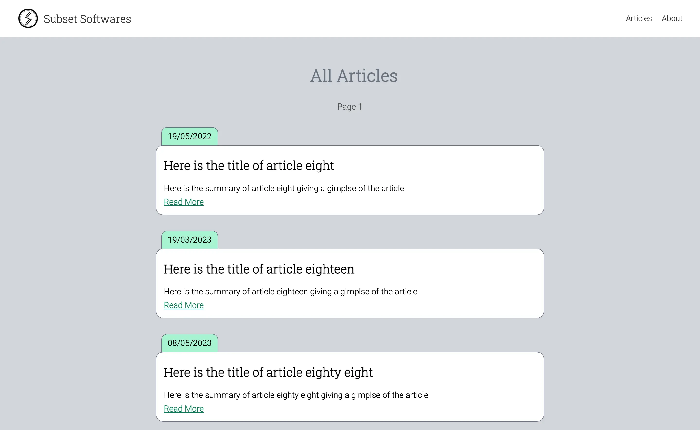
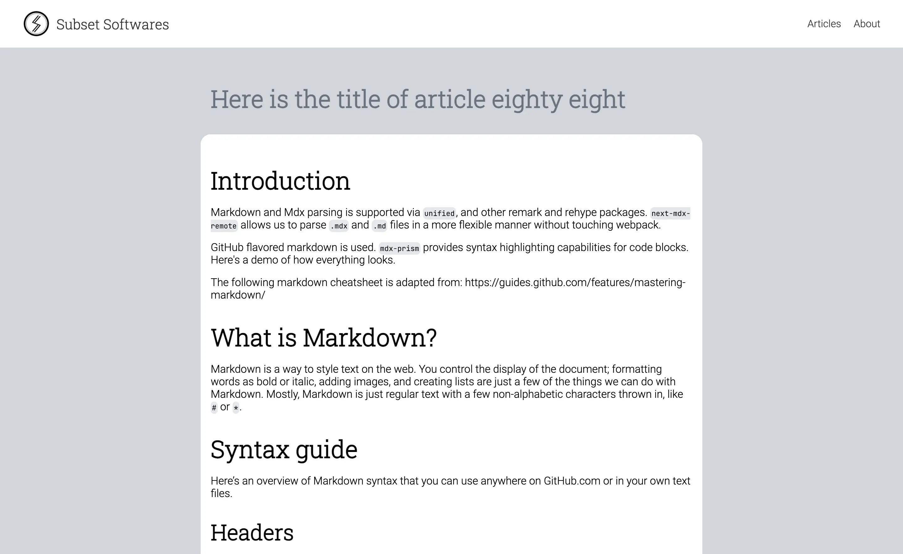
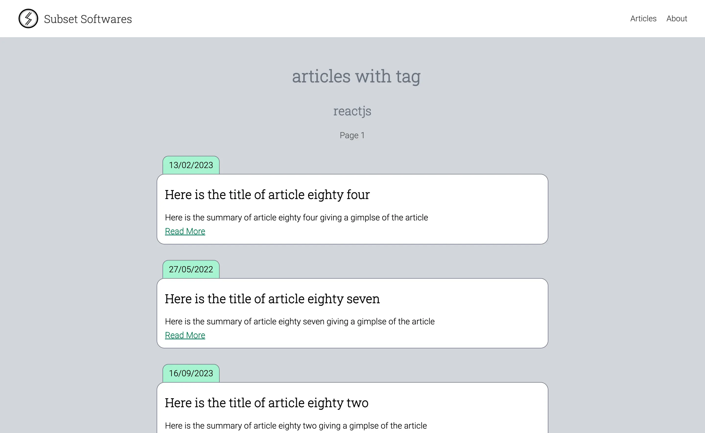

# NextJs MDX Blog Template

## Screenshots








## Getting Started

This project uses MDX pages within the `/articles` directory:

```
your-project
  ├── articles
  │   └── 2023
  │       └── article-one.mdx
  │   └── 2023
  │       └── article-two.mdx
  │   └── top-level.mdx
  └── package.json
```

All articles, top level or nested within sub-directories will be exposed as a flat list through **api endpoints**.

### Types

We extract params from the `mdx` file using `gray-matter` package and its exposed as `meta` object on the article data.

```ts
type Article = {
  meta: {
    title: string;
    summary: string;
    publishedDate: string;
    tags: string;
  };
  content: string;
  slug: string;
};

type ArticlesPageResult = {
  articles: Article[];
  page: number;
  limit: number;
  totalPages: number;
};
```

### /api/articles

The `/api/articles` endpoint returns articles based on pagination. So we get data in the form of `ArticlesPageResult`.

```ts
{
  articles: Article[];
  page: number;
  limit: number;
  totalPages: number;
};
```

### /api/articles/recent

This endpoint returns recent `N` articles where N is based on `RECENT_ARTICLES_COUNT` variable.

```ts
Array<{
  meta: {
    title: string;
    summary: string;
    publishedDate: string;
    tags: string;
  };
  content: string;
  slug: string;
}>;
```

### /api/article/[slug]

This endpoing returns the article based on the slug matching from the list of articles.

```ts
{
  meta: {
    title: string;
    summary: string;
    publishedDate: string;
    tags: string;
  }
  content: string;
  slug: string;
}
```

### /api/tags

This api looks for all the articles and collects the unique tags from them. While doing so we also capture the number of occurances. So the api returns the result in the following form.

```ts
Array<{ tag: string; count: number }>;
```

### /api/tags/popular

This api is an extension of `/api/tags` api and returns `N` tags where N is `TOP_TAGS_LIMIT`.

```ts
Array<{ tag: string; count: number }>;
```

### /api/tag/[tag]

This api returns all the articles which has a given tag. Since this is a pagination based api, the result of this api is similar to `/api/articles`.

```ts
{
  articles: Article[];
  page: number;
  limit: number;
  totalPages: number;
};
```

## Rendering of the articles

Each article is rendered using the `content` property from the `Article`.

```ts
{
  meta: {
    title: string;
    summary: string;
    publishedDate: string;
    tags: string;
  }
  // This property is used for rendering
  content: string;
  slug: string;
}
```

### react-markdown package

We use the `react-markdown` package to render the markdown content.

```ts
import Markdown from "react-markdown";

<Markdown className="markdown-preview">{article.content}</Markdown>;
```

### highlight.js

We use `highlight.js` package to highlight the code within the markdown after its rendered.

```ts
import hljs from "highlight.js";
```

## How this repo was created

```sh
npx create-next-app@latest --ts
```

- What is your project named? `nextjs-mdx-blog-template`
- Would you like to use ESLint? `Yes`
- Would you like to use Tailwind CSS? `No`
- Would you like to use `src/` directory? `No`
- Would you like to use App Router? (recommended) `No`
- Would you like to customize the default import alias (@/\*)? `No`

To read meta data information from the mdx files, we use `gray-matter` npm package.

```sh
npm install gray-matter
```

## Generating dummy mdx files

Usage: `node ./scripts/generate_mdx.js <output_directory> <number_of_files> [starting_index]`

```sh
node ./scripts/generate_mdx.js articles/2023 100

node ./scripts/generate_mdx.js articles/2024 100 101
```

NOTE: Last argument is for number starting index.
